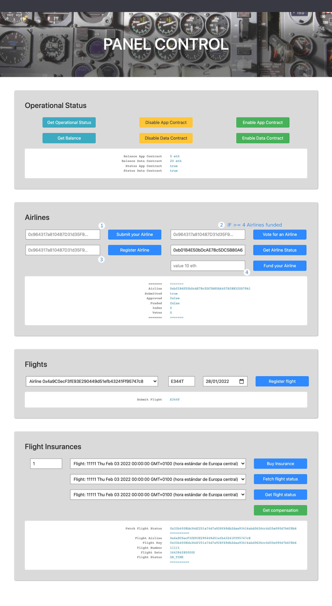

# FlightSurety

FlightSurety is a sample application project for Udacity's Blockchain course.

 
 
The first line (address [0]) is recorded along with the contract
 
 
1. Anyone can send an airline
 
 
2. If there are 4 or more funded airlines, the votes are taken into account for the consensus
 
 
3. Only the first airline can register other airlines sent, if there are already 4 airlines, other airlines can register other aerolines.
 
 
Anyone can consult the states of the airlines.
 
 
4. Only you can fund your airline if it has been registered by consensus or by the first line.
 
 
Anyone can purchase a flight, check its status and receive compensation if the correct flight status is met.
 
## Versions
Node: v15.11.0 
Truffle: v5.2.4 
Solidity: ^0.5.0

## Install

This repository contains Smart Contract code in Solidity (using Truffle), tests (also using Truffle), dApp scaffolding (using HTML, CSS and JS) and server app scaffolding.

To install, download or clone the repo, then:

`npm install`
`truffle compile`

## Develop Client

To run truffle tests:

`truffle test ./test/flightSurety.js`
`truffle test ./test/oracles.js`

To use the dapp:

`truffle migrate`
`npm run dapp`

To view dapp:

`http://localhost:8000`

## Develop Server

`npm run server`
`truffle test ./test/oracles.js`

